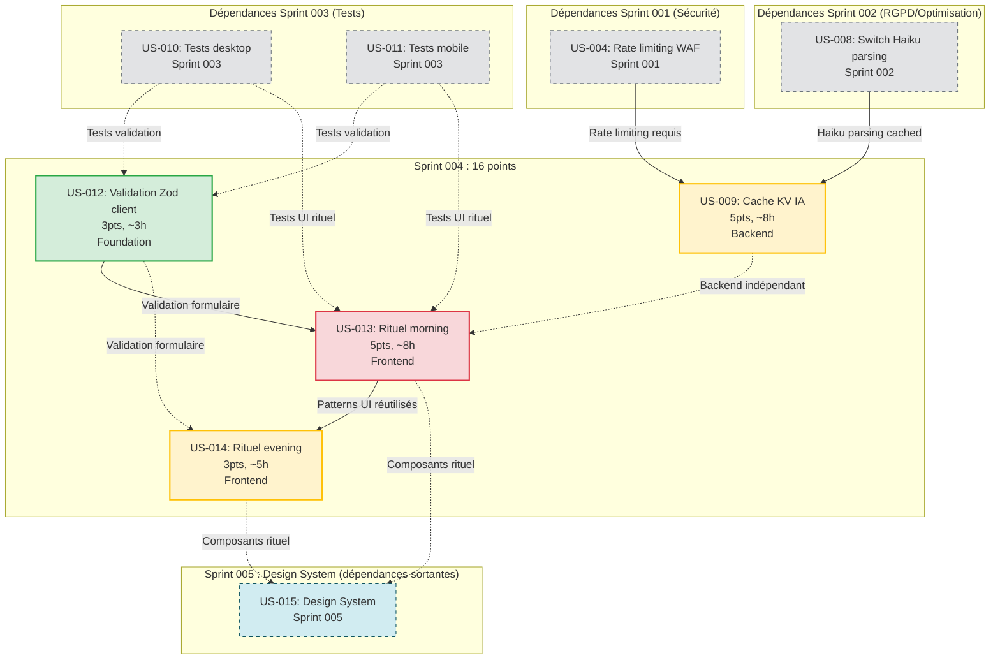

# Sprint 004 : UX Avancée & Cache IA — Dépendances

## Graphe de Dépendances des User Stories



---

## Dépendances Internes (Dans le Sprint)

| US Source | US Cible | Type | Description |
|-----------|----------|------|-------------|
| **US-012** | US-013 | Logique | Validation Zod requise pour formulaires rituel morning |
| **US-012** | US-014 | Logique | Validation Zod requise pour formulaires rituel evening |
| **US-009** | US-013 | Aucune | **Indépendant** : Cache backend vs rituel frontend, peuvent être parallèles |
| **US-013** | US-014 | Logique | Rituel evening réutilise patterns UI/UX du rituel morning |

**Ordre critique** :
1. **US-012 AVANT US-013** (bloquant)
2. **US-009 PARALLÈLE avec US-013** (backend indépendant)
3. **US-013 AVANT US-014** (patterns réutilisés)

---

## Dépendances Externes (Autres Sprints)

### Dépendances Entrantes (Sprint 001/002/003 → Sprint 004)

| Dépendance | Origine | Description | Impact si non résolue |
|------------|---------|-------------|----------------------|
| **US-004** | Sprint 001 | Rate limiting WAF requis pour cache KV (éviter spam) | Cache peut être abusé, coûts imprévisibles |
| **US-008** | Sprint 002 | Haiku parsing doit être actif pour bénéfice cache max | Cache moins efficace si Sonnet (requêtes plus chères) |
| **US-010** | Sprint 003 | Tests desktop nécessaires pour validation Zod + rituel UI | Risque régression sans tests |
| **US-011** | Sprint 003 | Tests mobile nécessaires pour validation Zod + rituel UI | Risque régression sans tests |

**Note critique** : Sprint 004 **ne devrait PAS démarrer** si Sprint 003 n'est pas terminé (risque régression élevé), mais **peut démarrer** si Sprint 001/002 sont terminés (dépendances backend prêtes).

---

### Dépendances Sortantes (Sprint 004 → Sprint 005)

| Dépendance | Destination | Description | Impact |
|------------|-------------|-------------|--------|
| **US-013, US-014** | US-015 | Composants rituel (Modal, Question, StarRating) seront intégrés au Design System | Sprint 005 bénéficie des composants existants, accélère DS |

**Note** : Sprint 005 (Design System) **peut démarrer** sans Sprint 004, mais **il est plus efficace** d'avoir les composants rituel comme base du DS.

---

## Ordre d'Exécution Recommandé

### Phase 1 : Foundation Validation (Jour 1-2, ~3h)
1. **US-012** : Validation Zod client (3h)

**Livrable** : Schémas Zod pour tous les formulaires, validation côté client active.

---

### Phase 2 : Backend + Frontend Parallèle (Jour 2-7, ~16h)

**Track Backend (5h)** :
2. **US-009** : Cache KV IA (8h)

**Track Frontend (8h)** :
3. **US-013** : Rituel morning (8h)

**Livrable** : Cache KV actif (hit rate ≥30%), rituel morning complet (desktop + mobile).

---

### Phase 3 : Rituel Evening (Jour 7-10, ~5h)
4. **US-014** : Rituel evening (5h)

**Livrable** : Rituel evening complet (desktop + mobile), flow matin/soir opérationnel.

---

## Timeline Parallèle (Optimisée)

```
Jour 1-2   [US-012 3h]
           ├─ Schémas Zod
           └─ Intégration React Hook Form

Jour 2-5   [US-009 8h — Backend] ← Parallèle → [US-013 8h — Frontend]
           ├─ Hash prompts                    ├─ UI Modal
           ├─ KV put/get                      ├─ 3 questions
           ├─ TTL 24h                         ├─ Génération plan IA
           └─ Metrics hit rate                └─ Animations

Jour 5-7   [US-013 finalisé + tests]

Jour 7-10  [US-014 5h]
           ├─ UI rating
           ├─ Review tâches
           └─ Suggestion IA
```

**Total : 24h planifiées, 40h disponibles → Buffer de 16h (40%)**

---

## Risques de Dépendances

| Risque | Probabilité | Impact | Mitigation |
|--------|-------------|--------|------------|
| Sprint 003 non terminé (tests manquants) | Faible | **CRITIQUE** | Sprint 003 prioritaire absolu, glissement Sprint 004 si nécessaire |
| Cache KV hit rate < 30% (échec objectif) | Moyenne | Moyen | Analyser patterns utilisateurs, ajuster TTL, logs détaillés |
| Rituel UI trop complexe (scope creep) | Moyenne | Élevé | **Figer scope** : morning = 3 questions, evening = 1 question + review |
| US-012 bloque US-013 (retard validation) | Faible | Moyen | Prioriser US-012 (jour 1-2), dev frontend peut commencer UI sans validation |
| Haiku moins performant pour rituel (US-008) | Faible | Moyen | Fallback Sonnet si accuracy < 95%, documenter limites |

---

## Checkpoints de Validation

### Checkpoint 1 (Fin Jour 2)
- ✅ US-012 done : Validation Zod active sur tous formulaires
- 📊 Tests validation : couverture ≥80% (schémas testés)

### Checkpoint 2 (Fin Jour 5)
- ✅ US-009 en review : Cache KV implémenté, tests hit rate
- ✅ US-013 en review : Rituel morning desktop + mobile
- 📊 Cache hit rate : ≥30% (logs Cloudflare)

### Checkpoint 3 (Fin Sprint)
- ✅ US-009 done : Cache KV en production, metrics validées
- ✅ US-013 done : Rituel morning en production
- ✅ US-014 done : Rituel evening en production
- 📊 Coûts IA : −30-50% (validation logs)
- 🎉 Flow matin/soir complet opérationnel

---

## Notes Techniques

### Partage de Code Entre US-013/US-014

**Composants réutilisables** :
```
/src/components/ritual
  /Modal.tsx         <- Partagé morning/evening
  /Question.tsx      <- Partagé morning/evening
  /ProgressBar.tsx   <- Morning uniquement
  /StarRating.tsx    <- Evening uniquement
  /TaskList.tsx      <- Evening uniquement
```

**Hooks réutilisables** :
```typescript
// src/hooks/useRitual.ts
export function useRitual(type: 'morning' | 'evening') {
  const [step, setStep] = useState(1);
  const [answers, setAnswers] = useState<string[]>([]);

  const handleAnswer = (answer: string) => {
    setAnswers([...answers, answer]);
    setStep(step + 1);
  };

  const generatePlan = async () => {
    return await api.generatePlan(type, answers);
  };

  return { step, answers, handleAnswer, generatePlan };
}
```

---

### Stratégie Cache KV (US-009)

**Cas d'usage cache** :

| Requête IA | Cacheable ? | TTL | Justification |
|------------|-------------|-----|---------------|
| Parsing événement | ✅ | 24h | Utilisateurs répètent événements similaires |
| Génération plan journée | ❌ | — | Contexte unique (réponses utilisateur) |
| Suggestion ajustements | ❌ | — | Basé sur tâches accomplies (toujours différent) |
| Classification tâche | ✅ | 7j | Catégories stables ("réunion", "email", etc.) |

**Métriques attendues** :

| Métrique | Avant Cache | Après Cache | Économie |
|----------|-------------|-------------|----------|
| **Coût parsing** | $0.0003/req | $0.0002/req (-33%) | 30-50% requêtes |
| **Latence parsing** | 1-2s | 200ms | 80-90% plus rapide |
| **Hit rate** | — | 30-50% | Validation logs |

**Monitoring** :
```typescript
// workers/api/src/metrics.ts
export async function logCacheMetrics(env: Env) {
  const hits = await env.METRICS.get('cache:hits');
  const misses = await env.METRICS.get('cache:misses');
  const hitRate = hits / (hits + misses) * 100;

  console.log(`Cache hit rate: ${hitRate.toFixed(1)}%`);

  // Alerting si < 30%
  if (hitRate < 30) {
    await sendAlert('Cache hit rate below target', { hitRate });
  }
}
```

---

### Gamification Rituel (US-013, US-014)

**Éléments gamification** :

1. **Streak** : Nombre de jours consécutifs où le rituel est complété
   - Badge 7 jours, 30 jours, 100 jours
   - Notification si risque rupture streak

2. **Confetti** : Animation à la fin du rituel morning (motivation)
   ```typescript
   import confetti from 'canvas-confetti';
   confetti({ particleCount: 100, spread: 70 });
   ```

3. **Progress** : Barre de progression (1/3, 2/3, 3/3)

4. **Analytics** : Tracking taux complétion
   ```typescript
   analytics.track('ritual:completed', {
     type: 'morning',
     duration: 120, // secondes
     skipped: false
   });
   ```

**Métriques cibles** :
- Taux complétion morning : ≥70%
- Taux complétion evening : ≥60%
- Streak moyen : ≥14 jours

---

## Activités Parallèles (Sprint 004)

### Documentation
- Guide utilisateur rituel matin/soir
- Documentation technique cache KV (ADR-004)
- Mise à jour README (nouvelles features V2)

### Préparation Sprint 005
- Audit composants existants (base Design System)
- Définition tokens design (couleurs, espacements, typographie)
- Setup Storybook (desktop + mobile)

### Refinement Backlog
- Affinage EPIC-005 (Design System V3)
- Affinage EPIC-006 (Intégrations calendriers)
- Planification Phase 4 (2026-Q3)

---

## Références

- `.claude/rules/05-kiss-dry-yagni.md` : KISS, DRY, YAGNI
- `.claude/rules/07-testing.md` : Principes TDD/BDD
- EPIC-004 : UX Avancée (V2)
- EPIC-003 : Coûts & Performance (V2)
- [Zod](https://zod.dev/)
- [Cloudflare KV](https://developers.cloudflare.com/kv/)
- [React Hook Form](https://react-hook-form.com/)

---

**Date de création** : 2026-06-15  
**Version** : 1.0.0  
**Statut** : Planifié
