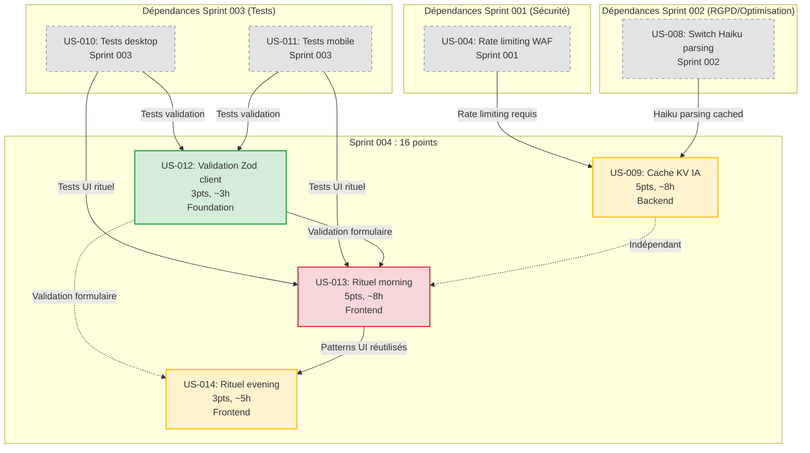

# Sprint 004 : UX Avancée & Cache IA

## Sprint Goal

**"Livrer le rituel de planification matin/soir et réduire les coûts IA de 30-50% via le cache KV."**

---

## Informations Sprint

- **Durée** : 2 semaines
- **Vélocité cible** : 20 points
- **Vélocité planifiée** : 16 points
- **Dates** : 2026-06-16 → 2026-06-27
- **Équipe** : Solo developer

---

## User Stories Sélectionnées

| ID | Titre | Points | Priorité | Dépend de |
|---------|--------------------------------------------------------|--------|----------|-----------|
| US-012 | Validation Zod client | 3 | Should | — |
| US-009 | Cache KV IA | 5 | Should | US-004, US-008 |
| US-013 | Rituel morning | 5 | Should | US-010, US-011 |
| US-014 | Rituel evening | 3 | Should | US-013 |

**Total : 16 points**

---

## Rationale : Sprint UX + Performance

Ce sprint combine **deux axes stratégiques** :
1. **UX avancée** (US-013, US-014) : Rituel matin/soir = killer feature différenciante
2. **Performance/Coûts** (US-009, US-012) : Cache IA + validation client = économies + réactivité

**Ordre d'exécution stratégique** :
- US-012 d'abord (foundation validation) → facilite US-013/US-014
- US-009 en parallèle (backend indépendant)
- US-013 puis US-014 (dépendance séquentielle)

---

## Ordre d'Exécution

1. **US-012** (Validation Zod client, 3pts, ~3h) — Foundation pour rituel UI
2. **US-009** (Cache KV IA, 5pts, ~8h) — Backend, indépendant, peut être parallèle
3. **US-013** (Rituel morning, 5pts, ~8h) — Frontend, dépend de US-012
4. **US-014** (Rituel evening, 3pts, ~5h) — Frontend, dépend de US-013

**Timeline** :
- **Jour 1-2** : US-012 (validation Zod)
- **Jour 2-5** : US-009 (cache KV) — parallèle avec US-013
- **Jour 3-7** : US-013 (rituel morning)
- **Jour 7-10** : US-014 (rituel evening)

---

## Graphe de Dépendances



---

## Cérémonies Sprint

| Cérémonie | Durée | Participants | Objectif |
|----------------------|---------|--------------|--------------------------------------------------|
| **Sprint Planning P1** | 2h | Solo | Sélection US, validation scope UX/cache |
| **Sprint Planning P2** | 2h | Solo | Décomposition tâches techniques |
| **Daily Standup** | 15min | Solo | Point quotidien (auto-réflexion) |
| **Backlog Refinement** | 5-10% | Solo | Affinage US Sprint 5 (Design System) |
| **Sprint Review** | 2h | Solo | Démo rituel + validation cache, DoD |
| **Sprint Retrospective** | 1.5h | Solo | Amélioration continue (format Starfish) |

---

## Incrément Livrable

**À la fin du Sprint 004, l'app aura des fonctionnalités UX différenciantes et sera optimisée IA :**

✅ **Rituel morning/evening implémenté** (killer feature différenciante)  
✅ **Coûts IA réduits de 30-50%** (cache KV sur requêtes répétées)  
✅ **Validation client Zod** (feedback immédiat utilisateur)  
✅ **UX fluide** (pas d'attente réseau pour validation)  
✅ **Foundation Design System** (composants rituel réutilisables Sprint 5)

**Definition of Done (DoD) :**
- Code reviewé (self-review)
- Tests unitaires ≥80% couverture
- Tests E2E rituel (desktop + mobile)
- Cache KV validé (logs hit rate ≥30%)
- Validation Zod testée (tous champs critiques)
- Documentation technique mise à jour
- CHANGELOG.md mis à jour
- Déployé en staging

---

## Rétrospective — Format Starfish

### Continue (à continuer)
<!-- Ce qui fonctionne bien et doit être maintenu -->

---

### Stop (à arrêter)
<!-- Ce qui ne fonctionne pas et doit être éliminé -->

---

### Start (à démarrer)
<!-- Nouvelles pratiques à adopter -->

---

### More (à faire plus)
<!-- Pratiques à intensifier -->

---

### Less (à faire moins)
<!-- Pratiques à réduire -->

---

### Actions d'Amélioration

| Action | Responsable | Échéance |
|--------|-------------|----------|
| | | |

---

## Directive Fondamentale de la Rétrospective

> **"La rétrospective est le moment sacré où l'équipe s'arrête pour inspecter et adapter sa façon de travailler. Sans rétrospective, il n'y a pas d'amélioration continue. Sans amélioration continue, il n'y a pas d'agilité."**
>
> — Ken Schwaber, co-créateur de Scrum

**Principes clés :**
- La rétrospective est **obligatoire** à chaque sprint
- Focus sur le **processus**, pas les personnes
- Actionnable : chaque insight → action concrète
- Transparence totale (safe space)
- Mesurable : suivre les actions du sprint précédent

---

## Risques Identifiés

| Risque | Probabilité | Impact | Mitigation |
|--------|-------------|--------|------------|
| Cache KV inefficace (hit rate < 30%) | Moyenne | Moyen | Analyser patterns utilisateurs, ajuster TTL, monitoring logs |
| Rituel UI trop complexe (scope creep) | Moyenne | Élevé | Figer scope : morning = 3 questions, evening = 1 question + review |
| Tests Sprint 003 non terminés | Faible | Élevé | Sprint 003 prioritaire, glissement Sprint 004 si nécessaire |
| Validation Zod manque edge cases | Faible | Faible | Tester avec fixtures Sprint 003, coverage ≥80% |

---

## Notes Techniques

### US-012 : Validation Zod Client

**Objectif** : Valider les formulaires côté client **avant** l'envoi API, pour feedback immédiat utilisateur.

**Stack** :
- **Zod** : Validation schema TypeScript-first
- **React Hook Form** : Gestion formulaires React
- **react-native-hook-form** : Gestion formulaires React Native

**Exemple** :
```typescript
// shared/schemas/event.ts
import { z } from 'zod';

export const EventSchema = z.object({
  title: z.string().min(1, "Titre requis").max(100, "Max 100 caractères"),
  start: z.date(),
  end: z.date(),
  location: z.string().optional(),
  description: z.string().max(500, "Max 500 caractères").optional()
}).refine(data => data.end > data.start, {
  message: "La fin doit être après le début",
  path: ["end"]
});

export type Event = z.infer<typeof EventSchema>;
```

**Usage React (desktop)** :
```tsx
import { useForm } from 'react-hook-form';
import { zodResolver } from '@hookform/resolvers/zod';
import { EventSchema, Event } from '@/schemas/event';

export function EventForm() {
  const { register, handleSubmit, formState: { errors } } = useForm<Event>({
    resolver: zodResolver(EventSchema)
  });

  const onSubmit = (data: Event) => {
    // Envoi API (déjà validé côté client)
  };

  return (
    <form onSubmit={handleSubmit(onSubmit)}>
      <input {...register('title')} />
      {errors.title && <span>{errors.title.message}</span>}
      {/* ... autres champs */}
    </form>
  );
}
```

**Champs critiques à valider** :
- Titre événement (requis, max 100 chars)
- Date/heure début (requis, format ISO)
- Date/heure fin (requis, après début)
- Email (format email valide)
- Mot de passe (min 12 chars, complexité)

---

### US-009 : Cache KV IA

**Objectif** : Cacher les réponses IA répétées pour réduire les coûts de 30-50%.

**Stratégie** :
1. **Hash du prompt** (clé cache)
2. **TTL** (Time To Live) : 24h pour parsing événements
3. **Invalidation** : Si événement modifié, invalider cache
4. **Hit rate target** : ≥30% (1 requête sur 3 servie par cache)

**Cloudflare Worker** :
```typescript
// workers/api/src/cache.ts
interface CacheEntry {
  response: string;
  timestamp: number;
  model: string; // 'haiku' ou 'sonnet'
}

export async function getCachedResponse(
  env: Env,
  prompt: string,
  model: string
): Promise<string | null> {
  const key = `ai:${model}:${hashPrompt(prompt)}`;
  const cached = await env.AI_CACHE.get<CacheEntry>(key, 'json');

  if (!cached) return null;

  // Vérifier TTL (24h)
  const age = Date.now() - cached.timestamp;
  if (age > 24 * 60 * 60 * 1000) {
    await env.AI_CACHE.delete(key);
    return null;
  }

  return cached.response;
}

export async function setCachedResponse(
  env: Env,
  prompt: string,
  model: string,
  response: string
): Promise<void> {
  const key = `ai:${model}:${hashPrompt(prompt)}`;
  const entry: CacheEntry = {
    response,
    timestamp: Date.now(),
    model
  };

  await env.AI_CACHE.put(key, JSON.stringify(entry), {
    expirationTtl: 24 * 60 * 60 // 24h
  });
}

function hashPrompt(prompt: string): string {
  // Hash SHA-256 du prompt (déterministe)
  return crypto.subtle.digest('SHA-256', new TextEncoder().encode(prompt))
    .then(buf => Array.from(new Uint8Array(buf))
      .map(b => b.toString(16).padStart(2, '0'))
      .join(''));
}
```

**Usage** :
```typescript
// workers/api/src/ai.ts
export async function parseEvent(env: Env, text: string): Promise<Event> {
  const prompt = `Parse ce texte en événement : ${text}`;

  // 1. Vérifier cache
  const cached = await getCachedResponse(env, prompt, 'haiku');
  if (cached) {
    console.log('Cache HIT');
    return JSON.parse(cached);
  }

  // 2. Appeler IA
  console.log('Cache MISS');
  const response = await env.AI.run('@cf/anthropic/claude-3-5-haiku', {
    messages: [{ role: 'user', content: prompt }]
  });

  // 3. Mettre en cache
  await setCachedResponse(env, prompt, 'haiku', JSON.stringify(response));

  return response;
}
```

**Métriques attendues** :
- Cache hit rate : 30-50% (utilisateurs répètent souvent les mêmes types d'événements)
- Économie : $0.0003 → $0 pour 30-50% des requêtes
- Latence : ~200ms (cache) vs ~1-2s (IA)

---

### US-013 : Rituel Morning

**Objectif** : Guider l'utilisateur chaque matin avec 3 questions IA personnalisées.

**Flow** :
1. **Trigger** : 8h00 (notification push, configurable)
2. **Question 1** : "Quelle est ta priorité #1 aujourd'hui ?"
3. **Question 2** : "Quels obstacles pourraient t'empêcher de l'atteindre ?"
4. **Question 3** : "Quelles ressources/personnes pourraient t'aider ?"
5. **Génération plan** : IA génère le plan de journée optimisé

**UI** :
- Modal plein écran (focus total)
- Progression 1/3, 2/3, 3/3 (motivation)
- Bouton "Ignorer" (pas forcé, mais tracking analytics)
- Animation confetti à la fin (gamification)

**Exemple React (desktop)** :
```tsx
export function MorningRitual() {
  const [step, setStep] = useState(1);
  const [answers, setAnswers] = useState<string[]>([]);

  const questions = [
    "Quelle est ta priorité #1 aujourd'hui ?",
    "Quels obstacles pourraient t'empêcher de l'atteindre ?",
    "Quelles ressources/personnes pourraient t'aider ?"
  ];

  const handleAnswer = (answer: string) => {
    setAnswers([...answers, answer]);
    if (step < 3) {
      setStep(step + 1);
    } else {
      // Génération plan IA
      generateDailyPlan(answers);
    }
  };

  return (
    <Modal>
      <Progress value={step} max={3} />
      <Question>{questions[step - 1]}</Question>
      <TextArea onSubmit={handleAnswer} />
      <Button variant="ghost" onClick={onSkip}>Ignorer</Button>
    </Modal>
  );
}
```

**Génération plan IA** :
```typescript
async function generateDailyPlan(answers: string[]): Promise<DailyPlan> {
  const prompt = `
    Contexte : Rituel matin utilisateur
    Priorité : ${answers[0]}
    Obstacles : ${answers[1]}
    Ressources : ${answers[2]}

    Génère un plan de journée optimisé avec :
    - 3-5 tâches concrètes
    - Timing (matin, après-midi, soir)
    - Ordre optimal

    Format JSON.
  `;

  const response = await ai.run('@cf/anthropic/claude-3-5-haiku', {
    messages: [{ role: 'user', content: prompt }]
  });

  return JSON.parse(response);
}
```

---

### US-014 : Rituel Evening

**Objectif** : Bilan de journée + préparation lendemain.

**Flow** :
1. **Trigger** : 20h00 (notification push, configurable)
2. **Question** : "Comment s'est passée ta journée ? (1-5 étoiles)"
3. **Review tâches** : Afficher tâches prévues vs accomplies
4. **Suggestion** : IA suggère ajustements pour demain

**UI** :
- Modal plein écran
- Étoiles cliquables (1-5)
- Liste tâches avec checkboxes
- Card suggestion IA (actionnable : "Appliquer")

**Exemple React (desktop)** :
```tsx
export function EveningRitual() {
  const [rating, setRating] = useState(0);
  const { tasks } = useDailyPlan();

  const handleComplete = async () => {
    const suggestion = await ai.generateSuggestion({
      rating,
      completed: tasks.filter(t => t.completed),
      pending: tasks.filter(t => !t.completed)
    });

    // Afficher suggestion
  };

  return (
    <Modal>
      <StarRating value={rating} onChange={setRating} />
      <TaskList tasks={tasks} onToggle={toggleTask} />
      <Button onClick={handleComplete}>Terminer</Button>
    </Modal>
  );
}
```

---

## Outils & Références

- **Zod** : [zod.dev](https://zod.dev/)
- **React Hook Form** : [react-hook-form.com](https://react-hook-form.com/)
- **Cloudflare KV** : [developers.cloudflare.com/kv](https://developers.cloudflare.com/kv/)
- **Cloudflare AI** : [developers.cloudflare.com/ai](https://developers.cloudflare.com/ai/)
- `.claude/rules/05-kiss-dry-yagni.md` : KISS, DRY, YAGNI
- EPIC-004 : UX Avancée (V2)
- EPIC-003 : Coûts & Performance (V2)

---

**Date de création** : 2026-06-15  
**Version** : 1.0.0  
**Statut** : En cours
